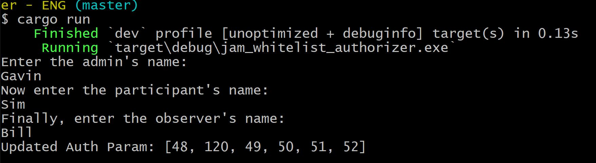
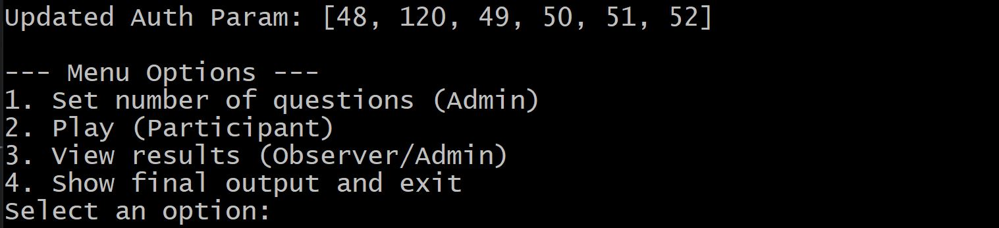
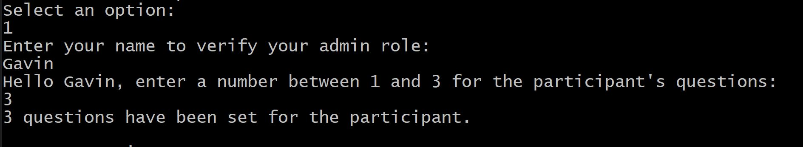
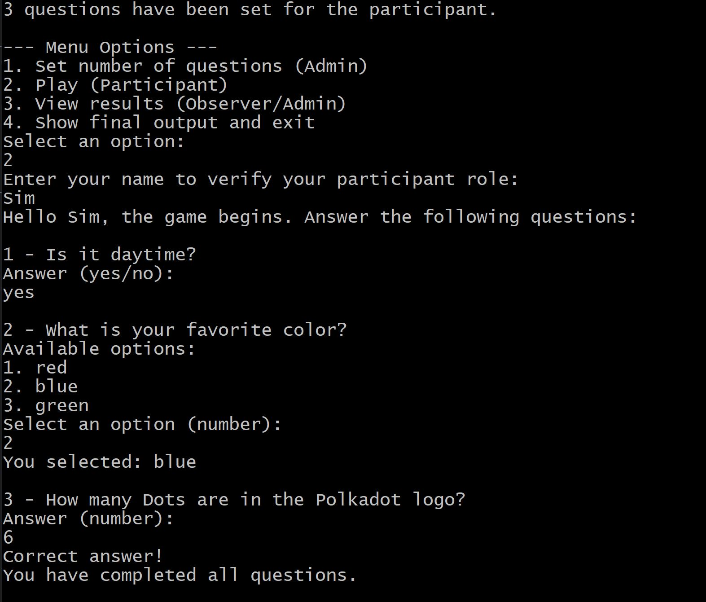
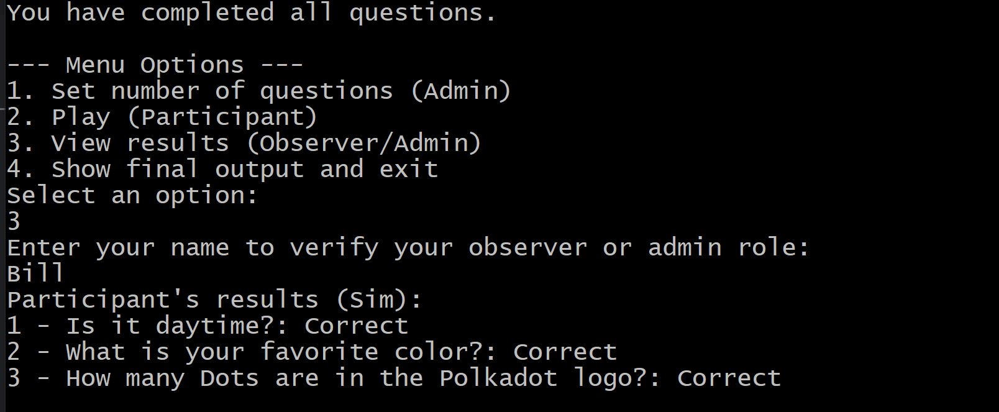
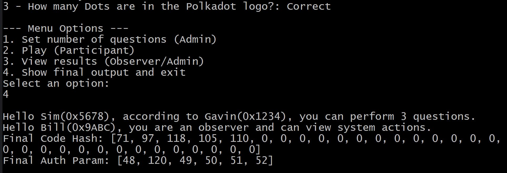

# **JAM Whitelist Authorizer**

This project implements a **role-based whitelist authorizer** using the JAM SDK (https://hackmd.io/@polkadot/jamsdk). It allows managing authorized addresses, user roles (admin, participant, observer), and **includes an interactive game** where participants answer questions. The results are supervised by observers and administrators.

---

## **Project Overview**

This program uses the **JAM SDK** to implement a role-based and whitelist authorization system. It includes the following features:

- **Roles**: Admin, participant, and observer.
- **Whitelist**: Only authorized addresses can perform certain actions.
- **Interactive Game**: Participants answer questions defined by the admin.
- **Results**: Results of the game are monitored by observers or admins.

The project is modular and extensible, allowing you to add new questions, roles, or functionalities.

---

## **JAM SDK Components**

The JAM SDK provides several tools and structures that are used in this project. Below is a brief explanation of the components and how they are integrated into the code:

### **1. `jam-types`**
- **Description**: This crate contains basic types and structures needed for working with services and authorizers in JAM.
- **Components Used**:
  - **`Authorizer`**: Represents the JAM system's authorizer. It contains two main fields:
    - `code_hash`: A hash representing the program code.
    - `param`: A parameter that can store additional information (e.g., the admin's address).
  - **`CodeHash`**: Represents a 32-byte hash used to validate whether a hash belongs to a list of valid hashes.
  - **`AuthParam`**: A parameter used to store data related to authorization.
- **Usage in the Project**:
  - `Authorizer` is used to manage the validation of authorized addresses.
  - A `CodeHash` is dynamically generated based on the admin's name and used to verify the authenticity of operations.
  - `AuthParam` is extended with the admin's address to track who performed certain actions.

### **2. `jam-pvm-common`**
- **Description**: Provides common functionalities for working with the PVM (Parity Virtual Machine).
- **Usage in the Project**:
  - Ensures that data generated by the authorizer is compatible with the PVM runtime environment.

### **3. `jam-bootstrap-service`**
- **Description**: A basic service useful for creating initial configurations (genesis) in JAM.
- **Usage in the Project**:
  - Cloned as a reference to understand how to configure a basic service in JAM.

### **4. `jam-null-authorizer`**
- **Description**: A basic authorizer that allows testing without authorization restrictions.
- **Usage in the Project**:
  - Used as a starting point to implement the custom authorizer (`RoleBasedWhitelistAuthorizer`).

### **5. `jam-pvm-build`**
- **Description**: A CLI tool that allows building PVM code blobs for services or authorizers.
- **Usage in the Project**:
  - Used to compile the custom authorizer into a PVM blob that can be deployed in the JAM environment.

---

## **Folder Structure**

The project is organized into two main folders, each containing the same functionality but written in different languages:

1. **`JAMspanish` Folder**:
   - Contains the code written in **Spanish**.
   - Ideal for Spanish-speaking developers or users who prefer documentation and comments in Spanish.

2. **`JAMenglish` Folder**:
   - Contains the code written in **English**.
   - Suitable for English-speaking developers or users who prefer documentation and comments in English.

Both folders include the same structure and functionality, ensuring consistency across languages.

## **Execution termial messages**

1. Assigning roles to participants

2. main menu

3. Option 1: Admin validation and selection of number of questions to ask

4. Option 2: Participant validation and answering questions

5. Option 3: Observer validation and viewing answers

6. Option 4: Verification of user roles and identification vectors
